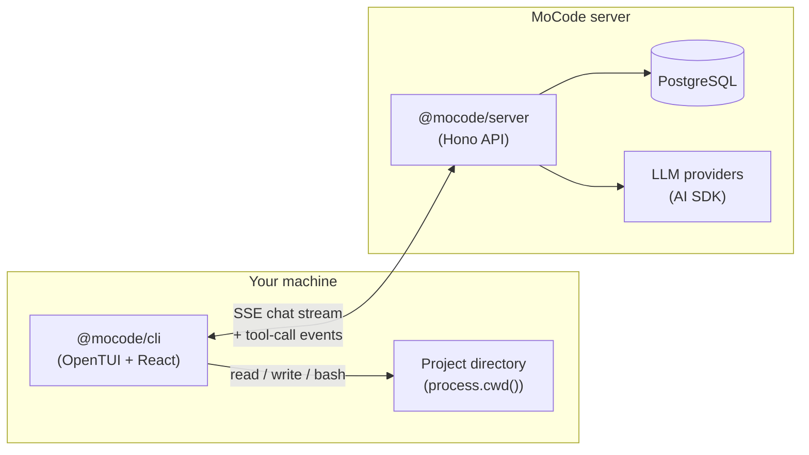

<div align="right">

**English** | [简体中文](./README.zh-CN.md)

</div>

# MoCode

**A terminal-native AI coding agent — plan, build, and ship from your shell.**

MoCode is a Bun monorepo that pairs a rich **TUI client** with a **Hono API server**. The server streams multi-step agent responses from leading LLM providers; the CLI executes file and shell tools **locally** in your project directory, so your code never leaves your machine.

---

## Features

| | |
|---|---|
| **Dual agent modes** | **Plan** — read-only exploration and architecture. **Build** — full read/write/bash toolset for implementation. |
| **Local tool execution** | The server defines tools; the CLI runs them against `process.cwd()` with path sandboxing. |
| **Multi-provider models** | Anthropic, OpenAI, Google, Groq, Cerebras, and OpenRouter — switch models mid-session with `/models`. |
| **Session persistence & recovery** | PostgreSQL (SaaS) or local JSON (`--local`). Esc keeps partial text; tool Esc marks `Interrupted by user` and stops immediately; auto-resume on user-only tail; partial assistant uses `/resume` (regenerate). See [Session recovery](#session-recovery). |
| **Rich TUI** | Built with [OpenTUI](https://github.com/opentui/opentui) + React 19 — themes, dialogs, keyboard layers, and slash commands. |
| **OAuth sign-in** | Browser-based PKCE flow via Clerk; tokens stored at `~/.mocode/auth.json`. |
| **Credits billing** | Polar-powered prepaid credits gate usage; `/upgrade` and `/usage` open checkout and portal in the browser. |

---

## Architecture



**Request flow**

1. You type a message in the TUI; the CLI POSTs to `/chat/:sessionId/submit`.
2. The server calls `streamText` with mode-specific tool contracts from `@mocode/shared`.
3. Tool-call events stream back over SSE; the CLI executes them locally and posts results.
4. When all tool outputs are complete, the assistant message is persisted to PostgreSQL.
5. Token usage is converted to credits and reported to Polar.

---

## Tech stack

| Layer | Technologies |
|---|---|
| Runtime | [Bun](https://bun.sh) |
| CLI | OpenTUI, React 19, React Router, AI SDK React |
| Server | Hono, Vercel AI SDK, Clerk, Polar, Sentry |
| Database | PostgreSQL, Prisma 7 |
| Shared | Zod schemas, tool contracts, model catalog |

---

## Prerequisites

- **Bun** ≥ 1.0 ([install](https://bun.sh))
- **PostgreSQL** (local or hosted)
- API keys for at least one LLM provider (see [Environment variables](#environment-variables))
- For auth & billing in production: [Clerk](https://clerk.com) and [Polar](https://polar.sh) accounts

---

## Quick start

### 1. Clone and install

```bash
git clone https://github.com/moyunzero/mocode.git
cd mocode
bun install
```

### 2. Configure environment

```bash
cp .env.example .env
```

Edit `.env` with your `DATABASE_URL`, provider API keys, and `API_URL` (default `http://localhost:3000`).

### 3. Initialize the database

```bash
cd packages/database
bunx prisma db push
cd ../..
```

### 4. Start the server

```bash
bun run dev:server
```

The API listens on **port 3000**.

### 5. Run the CLI

In a second terminal, from your **project directory**:

```bash
# Development (from the mocode repo)
bun run dev:cli

# Or build and link globally
bun run link:cli
mocode
```

> **Tip:** Run `mocode` from the repository you want the agent to work in — all file tools are scoped to `process.cwd()`.

---

## Environment variables

| Variable | Required | Description |
|---|---|---|
| `API_URL` | CLI | Base URL of the Hono server (default `http://localhost:3000`) |
| `DATABASE_URL` | Server | PostgreSQL connection string |
| `ANTHROPIC_API_KEY` | Server | Anthropic API key |
| `OPENAI_API_KEY` | Server | OpenAI API key |
| `GOOGLE_GENERATIVE_AI_API_KEY` | Server | Google AI Studio key |
| `GROQ_API_KEY` | Server | Groq API key |
| `CEREBRAS_API_KEY` | Server | Cerebras API key |
| `OPENROUTER_API_KEY` | Server | OpenRouter API key |
| `CLERK_SECRET_KEY` | Server | Clerk secret key (auth) |
| `CLERK_PUBLISHABLE_KEY` | Server | Clerk publishable key |
| `CLERK_FRONTEND_API` | CLI | Clerk frontend API domain |
| `CLERK_OAUTH_CLIENT_ID` | CLI | OAuth client ID for PKCE login |
| `POLAR_ACCESS_TOKEN` | Server | Polar API token (billing) |
| `POLAR_PRODUCT_ID` | Server | Polar product for credit packs |
| `POLAR_CREDITS_METER_ID` | Server | Polar meter for usage tracking |
| `SENTRY_DSN` | Server | Optional Sentry DSN |

See [`.env.example`](./.env.example) for the full list and inline comments.

---

## CLI reference

### Slash commands

| Command | Description |
|---|---|
| `/new` | Start a new conversation |
| `/agents` | Switch between **Build** and **Plan** modes |
| `/models` | Select an AI model |
| `/sessions` | Browse and resume past sessions |
| `/resume` | **Regenerate** from the last user message (after Esc on a partial assistant) |
| `/theme` | Change the color theme |
| `/login` | Sign in via browser (Clerk OAuth) |
| `/logout` | Sign out locally |
| `/upgrade` | Open credits checkout (Polar) |
| `/usage` | Open billing portal |
| `/exit` | Quit the application |

Type `/` in the input bar to open the command palette.

### Keyboard shortcuts

| Key | Action |
|---|---|
| `Tab` | Toggle Build ↔ Plan mode |
| `Enter` | Submit message |
| `Esc` | Interrupt streaming; restore composer before first token; mark running tools `Interrupted by user` |
| `Shift+Enter` / `Ctrl+J` / `Option+Enter` | Insert newline (terminal-dependent) |

On macOS Terminal.app, run `mocode --terminal-setup` once to enable Option-as-Meta for newline.

### Session recovery

Storage: **SaaS** → PostgreSQL; **`mocode --local`** → `~/.mocode/sessions/` JSON files.

| Scenario | Behavior |
|----------|----------|
| Esc during streaming text | Partial assistant text **kept** in transcript; survives session reopen |
| Esc before first visible token | **Restores composer** text; strips empty assistant placeholder |
| Esc while tool (bash/MCP) runs | Tool line shows **`Interrupted by user`**; generation **stops immediately** (local subprocess killed) |
| Reopen session, last message is **user** only | Generation **starts automatically** (no `/resume`) |
| Reopen session, last message is **partial assistant** | Does **not** auto-resume; run **`/resume`** manually |
| `/resume` on partial assistant | **Regenerates** a full new reply from the last user turn (not append-in-place) |

> **Note:** MoCode `/resume` continues interrupted **generation** within the current session. Claude Code's `/resume` opens the **session picker** — use MoCode **`/sessions`** for that.

Interrupted assistant footers show only dim `◉ Build › model` (and duration when available)—**no** uppercase `INTERRUPTED` banner.

Implementation details: [`doc/harness-phase-03-stream-reliability-notes.md`](./doc/harness-phase-03-stream-reliability-notes.md).

---

## Supported models

| Model | Provider |
|---|---|
| `claude-sonnet-4-6` | Anthropic |
| `claude-haiku-4-5` | Anthropic |
| `claude-opus-4-6` | Anthropic |
| `gpt-5.4` | OpenAI |
| `gpt-5.4-mini` | OpenAI |
| `gpt-5.4-nano` | OpenAI |
| `gemini-2.5-flash` | Google |
| `llama-3.3-70b-versatile` | Groq |
| `gpt-oss-120b` | Cerebras |
| `openai/gpt-oss-120b:free` | OpenRouter |

The canonical list lives in `packages/shared/src/models.ts`.

---

## Agent tools

Tools are defined in `@mocode/shared` and executed on the CLI.

| Tool | Plan | Build | Description |
|---|---|---|---|
| `readFile` | ✓ | ✓ | Read a file in the project |
| `listDirectory` | ✓ | ✓ | List directory entries |
| `glob` | ✓ | ✓ | Find files by glob pattern |
| `grep` | ✓ | ✓ | Search file contents with regex |
| `writeFile` | | ✓ | Create or overwrite a file |
| `editFile` | | ✓ | Replace exact text in a file |
| `bash` | | ✓ | Run a shell command |

All paths are resolved relative to `process.cwd()` and cannot escape the project directory.

---

## Development

```bash
# Run CLI with hot reload
bun run dev:cli

# Run server with hot reload
bun run dev:server

# Build CLI binary
bun run build:cli

# Run tests (CLI + server — 193 tests incl. stream reliability)
bun test packages/cli packages/server

# Test LLM provider connectivity
bun run --cwd packages/server test:providers
```

### Project structure

```
mocode/
├── packages/
│   ├── cli/          # TUI client (@mocode/cli) — `mocode` binary
│   ├── server/       # Hono API (@mocode/server)
│   ├── database/     # Prisma schema & client (@mocode/database)
│   └── shared/       # Models, schemas, tool contracts (@mocode/shared)
├── .env.example
└── package.json      # Bun workspaces root
```

---

## License

[MIT](./LICENSE)
