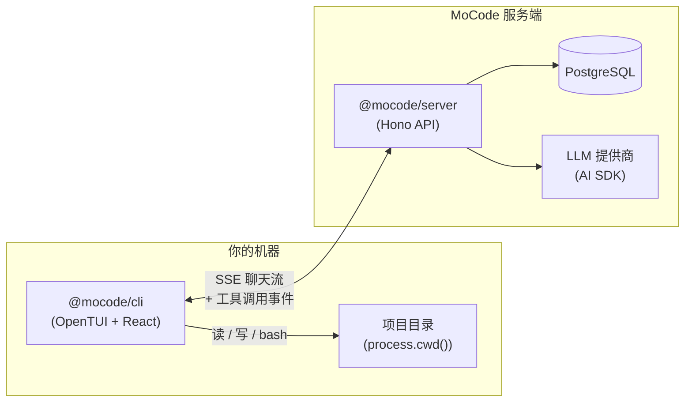

<div align="right">

[English](./README.md) | **简体中文**

</div>

# MoCode

**终端原生 AI 编程助手 —— 在 Shell 里规划、构建、交付。**

MoCode 是一个基于 Bun 的 monorepo，由功能丰富的 **TUI 客户端** 与 **Hono API 服务端** 组成。服务端通过主流 LLM 提供商流式输出多步 Agent 响应；CLI 在本地项目目录中执行文件与 Shell 工具，**代码始终留在你的机器上**。

---

## 功能特性

| | |
|---|---|
| **双 Agent 模式** | **Plan** — 只读探索与架构分析。**Build** — 完整读写/bash 工具集，用于实现代码。 |
| **本地工具执行** | 服务端定义工具契约，CLI 在 `process.cwd()` 下执行，并做路径沙箱隔离。 |
| **多模型支持** | Anthropic、OpenAI、Google、Groq、Cerebras、OpenRouter — 会话中随时用 `/models` 切换。 |
| **会话持久化与恢复** | PostgreSQL（SaaS）或本地 JSON（`--local`）。Esc 保留 partial 正文；工具执行中 Esc 标记 `Interrupted by user` 并立即停止；末条 user 重开自动续写；partial 助手需 `/resume`（regenerate）。详见 [会话恢复](#会话恢复)。 |
| **富 TUI 界面** | 基于 [OpenTUI](https://github.com/opentui/opentui) + React 19 — 主题、对话框、键盘层与斜杠命令。 |
| **OAuth 登录** | 通过 Clerk 的浏览器 PKCE 流程；Token 保存在 `~/.mocode/auth.json`。 |
| **积分计费** | Polar 预付费积分门控；`/upgrade` 与 `/usage` 在浏览器中打开结账与账单门户。 |

---

## 架构



**请求流程**

1. 在 TUI 中输入消息，CLI POST 到 `/chat/:sessionId/submit`。
2. 服务端调用 `streamText`，按模式注入 `@mocode/shared` 中的工具契约。
3. 工具调用事件通过 SSE 流回；CLI 在本地执行并将结果回传。
4. 所有工具输出完成后，Assistant 消息写入 PostgreSQL。
5. Token 用量换算为积分，上报至 Polar。

---

## 技术栈

| 层级 | 技术 |
|---|---|
| 运行时 | [Bun](https://bun.sh) |
| CLI | OpenTUI、React 19、React Router、AI SDK React |
| 服务端 | Hono、Vercel AI SDK、Clerk、Polar、Sentry |
| 数据库 | PostgreSQL、Prisma 7 |
| 共享层 | Zod Schema、工具契约、模型目录 |

---

## 环境要求

- **Bun** ≥ 1.0（[安装指南](https://bun.sh)）
- **PostgreSQL**（本地或托管）
- 至少一个 LLM 提供商的 API Key（见[环境变量](#环境变量)）
- 生产环境如需认证与计费：[Clerk](https://clerk.com) 与 [Polar](https://polar.sh) 账号

---

## 快速开始

### 1. 克隆并安装

```bash
git clone https://github.com/moyunzero/mocode.git
cd mocode
bun install
```

### 2. 配置环境变量

```bash
cp .env.example .env
```

编辑 `.env`，填入 `DATABASE_URL`、LLM API Key，以及 `API_URL`（默认 `http://localhost:3000`）。

### 3. 初始化数据库

```bash
cd packages/database
bunx prisma db push
cd ../..
```

### 4. 启动服务端

```bash
bun run dev:server
```

API 监听 **3000** 端口。

### 5. 运行 CLI

在第二个终端中，进入**你要让 Agent 操作的项目目录**：

```bash
# 开发模式（在 mocode 仓库内）
bun run dev:cli

# 或构建并全局链接
bun run link:cli
mocode
```

> **提示：** 在目标项目目录下运行 `mocode` — 所有文件工具均限定于 `process.cwd()`。

---

## 环境变量

| 变量 | 必需 | 说明 |
|---|---|---|
| `API_URL` | CLI | Hono 服务端地址（默认 `http://localhost:3000`） |
| `DATABASE_URL` | 服务端 | PostgreSQL 连接字符串 |
| `ANTHROPIC_API_KEY` | 服务端 | Anthropic API Key |
| `OPENAI_API_KEY` | 服务端 | OpenAI API Key |
| `GOOGLE_GENERATIVE_AI_API_KEY` | 服务端 | Google AI Studio Key |
| `GROQ_API_KEY` | 服务端 | Groq API Key |
| `CEREBRAS_API_KEY` | 服务端 | Cerebras API Key |
| `OPENROUTER_API_KEY` | 服务端 | OpenRouter API Key |
| `CLERK_SECRET_KEY` | 服务端 | Clerk Secret Key（认证） |
| `CLERK_PUBLISHABLE_KEY` | 服务端 | Clerk Publishable Key |
| `CLERK_FRONTEND_API` | CLI | Clerk Frontend API 域名 |
| `CLERK_OAUTH_CLIENT_ID` | CLI | PKCE 登录 OAuth Client ID |
| `POLAR_ACCESS_TOKEN` | 服务端 | Polar API Token（计费） |
| `POLAR_PRODUCT_ID` | 服务端 | 积分包对应的 Polar Product |
| `POLAR_CREDITS_METER_ID` | 服务端 | 用量追踪 Meter ID |
| `SENTRY_DSN` | 服务端 | 可选，Sentry DSN |

完整列表见 [`.env.example`](./.env.example)。

---

## CLI 参考

### 斜杠命令

| 命令 | 说明 |
|---|---|
| `/new` | 开始新对话 |
| `/agents` | 切换 **Build** / **Plan** 模式 |
| `/models` | 选择 AI 模型 |
| `/sessions` | 浏览并恢复历史会话 |
| `/resume` | 从最后一条 user 消息 **重新生成**（partial 助手被 Esc 中断后） |
| `/theme` | 切换配色主题 |
| `/login` | 浏览器登录（Clerk OAuth） |
| `/logout` | 本地登出 |
| `/upgrade` | 打开积分购买页（Polar） |
| `/usage` | 打开账单门户 |
| `/exit` | 退出应用 |

在输入框中输入 `/` 打开命令面板。

### 快捷键

| 按键 | 操作 |
|---|---|
| `Tab` | 切换 Build ↔ Plan 模式 |
| `Enter` | 提交消息 |
| `Esc` | 中断流式回复；首 token 前恢复输入框；工具执行中标记 `Interrupted by user` |
| `Shift+Enter` / `Ctrl+J` / `Option+Enter` | 换行（取决于终端） |

macOS Terminal.app 可运行 `mocode --terminal-setup` 一次，启用 Option-as-Meta 以支持换行。

### 会话恢复

持久化位置：**SaaS** → PostgreSQL；**`mocode --local`** → `~/.mocode/sessions/` 本地 JSON。

| 场景 | 行为 |
|------|------|
| 流式正文中 Esc | partial 助手文本**保留**在 transcript；重开 session 仍可见 |
| 首个可见 token 前 Esc | **恢复输入框**原文；移除空 assistant 占位；可编辑后重发 |
| 工具（bash/MCP）执行中 Esc | 工具行显示 **`Interrupted by user`**；**立即停止**生成（kill 本地子进程） |
| 重开 session，末条为 **user**（无 assistant） | **自动**开始生成（无需 `/resume`） |
| 重开 session，末条为 **partial assistant** | **不**自动续写；手动输入 **`/resume`** |
| `/resume`（partial 助手） | 从最后 user 消息 **regenerate** 完整新回复（非 append 续写 partial） |

> **说明：** MoCode 的 `/resume` 用于**当前会话内**续写/重试生成；Claude Code 的 `/resume` 是**切换历史会话**，MoCode 请用 **`/sessions`**。

中断的 assistant 消息 footer 仅显示 dim 的 `◉ Build › model`（及 duration，若流已结束）；**无**大写 `INTERRUPTED` 横幅。

实现细节：[`doc/harness-phase-03-stream-reliability-notes.md`](./doc/harness-phase-03-stream-reliability-notes.md)。

---

## 支持的模型

| 模型 | 提供商 |
|---|---|
| `claude-sonnet-4-6` | Anthropic |
| `claude-haiku-4-5` | Anthropic |
| `claude-opus-4-6` | Anthropic |
| `gpt-5.4` | OpenAI |
| `gpt-5.4-mini` | OpenAI |
| `gpt-5.4-nano` | OpenAI |
| `gemini-2.5-flash` | Google |
| `llama-3.3-70b-versatile` | Groq |
| `gpt-oss-120b` | Cerebras |
| `openai/gpt-oss-120b:free` | OpenRouter |

权威列表见 `packages/shared/src/models.ts`。

---

## Agent 工具

工具定义在 `@mocode/shared`，由 CLI 本地执行。

| 工具 | Plan | Build | 说明 |
|---|---|---|---|
| `readFile` | ✓ | ✓ | 读取项目内文件 |
| `listDirectory` | ✓ | ✓ | 列出目录内容 |
| `glob` | ✓ | ✓ | 按 glob 查找文件 |
| `grep` | ✓ | ✓ | 正则搜索文件内容 |
| `writeFile` | | ✓ | 创建或覆盖文件 |
| `editFile` | | ✓ | 精确替换文件中的文本 |
| `bash` | | ✓ | 执行 Shell 命令 |

所有路径相对于 `process.cwd()` 解析，无法逃逸出项目目录。

---

## 开发

```bash
# CLI 热重载
bun run dev:cli

# 服务端热重载
bun run dev:server

# 构建 CLI
bun run build:cli

# 运行测试
# 运行测试（CLI + server，含流式可靠性共 193 项）
bun test packages/cli packages/server

# 测试 LLM 提供商连通性
bun run --cwd packages/server test:providers
```

### 项目结构

```
mocode/
├── packages/
│   ├── cli/          # TUI 客户端 (@mocode/cli) — `mocode` 二进制
│   ├── server/       # Hono API (@mocode/server)
│   ├── database/     # Prisma Schema 与 Client (@mocode/database)
│   └── shared/       # 模型、Schema、工具契约 (@mocode/shared)
├── .env.example
└── package.json      # Bun workspaces 根目录
```

---

## 许可证

[MIT](./LICENSE)
